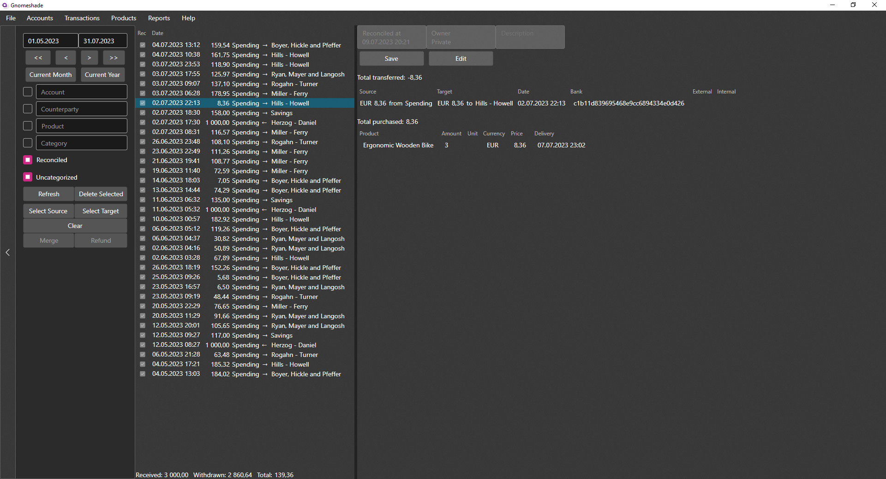

# Gnomeshade

A free, open source and self-hosted personal finance manager.

## Getting Started

Before installing the server yourself, you can try out the client using the
[demo server](https://gnomeshade-demo.azurewebsites.net/).
For instructions on how to install the client see
[gnomeshade.org/getting-started#install-client](https://www.gnomeshade.org/getting-started#install-client).
Note that the demo server is publicly accessible by anyone, so be careful entering person information.
The demo server is also periodically wiped.

Instructions for setting up the server yourself can be found
at [gnomeshade.org/getting-started#install](https://www.gnomeshade.org/getting-started#install).
For more detailed information about server configuration
see [gnomeshade.org/configuration](https://www.gnomeshade.org/configuration).

## Contributing

Instructions for contributing can be found in [CONTRIBUTING.md](CONTRIBUTING.md).

## License

This work [is licensed](LICENSE.txt) under the
[GNU Affero General Public License v3.0 or later](https://www.gnu.org/licenses/agpl-3.0.html).
